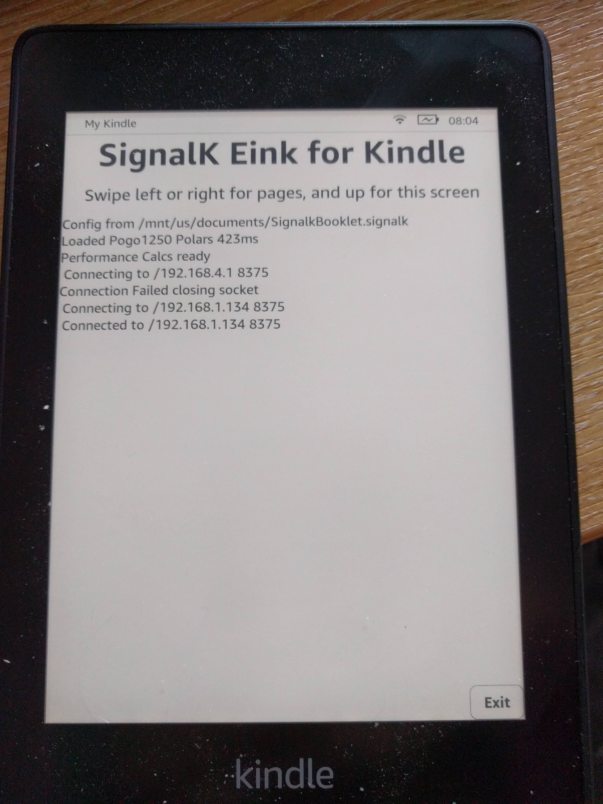
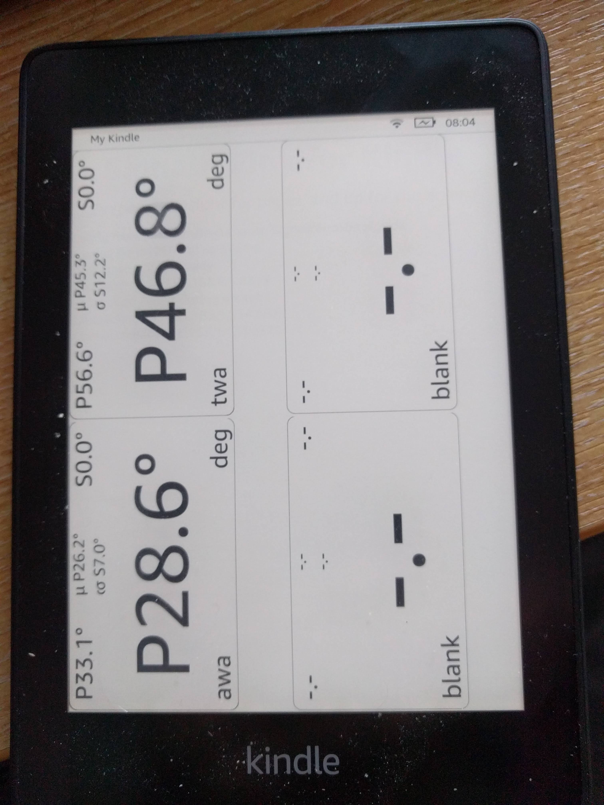
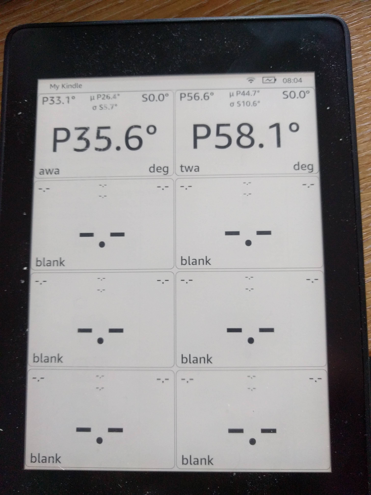
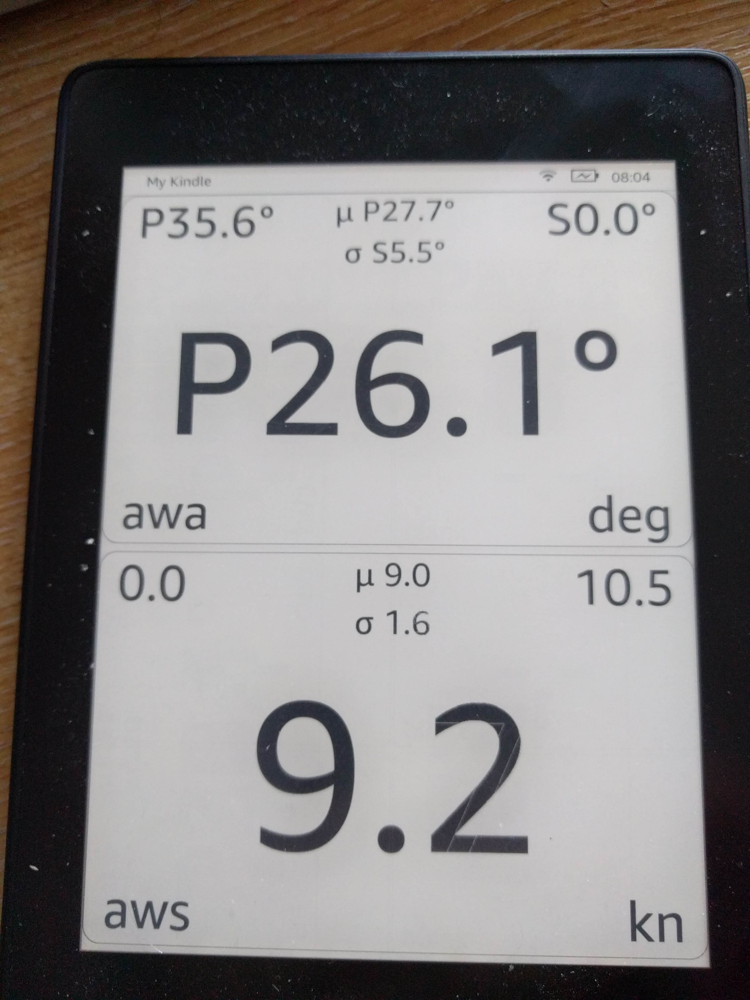

# SignalK EInk Booklet

This is a Kindle Booklet for SignalK that allows you to open a book on a Kindle Paperwhite that displays pages
of graphical instruments that display real time data from a SignalK server on the network.

Kindle UIs are Java Swing applications running inside a lightweight OSGi Framework.

It recognises the mimetype of the "book" and launches the registered Booklet application (SignalkBooklet.java) which then 
reads the json inside the book file, configures the UI with pages of widgets (EInkTextBox.java).

It then either starts network discovery using mDNS to find a Signalk server on the network, or attempts to connect to a 
list of host port combinations from the book json. 

When the booklet is running navigation is by finger swipes left and right to change pages.

Multiple books may be added to the kindle over the USB Mount, placed in the documents folder. see config.json for 
an example of configuration.

Dont expect fantastic graphics animations. Kindle screens are great in full sunlight, but the eink technology is very slow
and requires careful slow redrawing to avoid shadows and ink left behind. The Paperwhite 4 is IP68 waterproof and the battery
lasts for many many hours. 

# Developing

You can run locally (Main.java)

# Kindle Architecture

see https://wiki.mobileread.com/wiki/Kindle_Touch_Hacking#Architecture worth reading to understand the internals before 
trying to use this project.

# Kindle setup

To use this app you need to get a developer key onto the Kindle. Recent Kindles have USBNetworking that allows you to 
login as root over IP (default password mario, as per https://www.sven.de/kindle/), put the root drive into writable and
install your developer key. You can also use packages from https://wiki.mobileread.com/wiki/Kindle_Touch_Hacking#Architecture 
to automate this however you may need to disable firmware updates to prevent your key from being deleted.

All Jars running on a Kindle must be signed by a key loaded onto the kindle so this step is required.

# Developer setup

The maven build produces an installable package that can be installed with the MPRI package installed that is part of KUAL, 
however it has some dependencies. 

## Kindle SDK

AFAIK, Amazon doesn't distribute a Kindle SDK, and I can't distribute it, so you have to extract the API Jars from your Kindle. Copy the contents of 
/opt/amazon/ebook on the Kindle which should be symlinked to opt_amazon_ebook. That tree contains the SDK. This version
of the code is being built against Firmware version 5.10.0.1. Some of the classes are obfuscated and you may have to adjust
the code here if your Firmware is different.

## Java version

The Java version on a Kindle is an embedded JVM based on 1.8 (cvm). It has a cut down list of classes so many standard libraries
wont work. You will find a list of all classes in /usr/java/lib/classlist. The version of Swing is different from
a standard JDK with some methods missing and some behaviours different. Font point sizes dont correlate well to a standard
JDK after taking into account screen resolution. There are a number of Jars loaded into the OSGi framework, however Booklets
do not seem to be loaded as OSGi bundles and the normal classpath resolution process doesnt appear to work. You cant 
embed libraries into a jar and must unpack all the classes into the Jar that are required for a booklet. Simple JSON is 
available, but even simple things like parsing yaml with standard libraries doesnt work.

## Kindle tool

The final packaging and signing is performed using kindletool which can be found here https://github.com/NiLuJe/KindleTool

## Building

Building is achieved using mvn clean install. It will build the jar, build the package and put the result in target

## Installation

Copy the install image onto the kindle and run the MRPI package script. This will install the package and restart the Kindle UI.

eg 

        mvn clean install && \\
           scp  target/Update_Signalk_uk.co.tfd.kindle.signalk_976ed_install.bin  root@192.168.15.244:/mnt/us/mrpackages && \\
           ssh root@192.168.15.244  "/mnt/us/extensions/MRInstaller/bin/mrinstaller.sh launch_installer"

192.168.15.244 is the USBNet IP address of the Kindle when plugged in.

## Logs

slf4j logs to /var/tmp/signalk.log The slf4j settings are in the SignalkBooklet class. They must be set before any SLF4J classes
are created. 

## Booklets

Create files in /mnt/us/documents called .signalk containing json (eg /mnt/us/documents/OnDeck.signalk), see src/test/resources/config.json for an example.